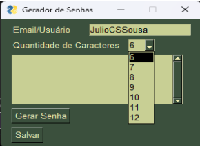
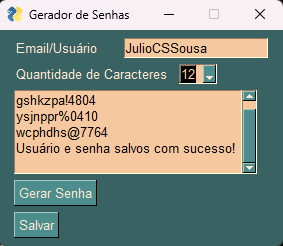

Este Aplicativo tem como objetivo criar senhas aleatórias

Funciona de forma simples: 

Insere-se um Usuário

Escolhe uma quantidade de caracteres que se deseja

Clica em "Gerar Senha"

Será gerada uma senha aleatória com letras minúsculas, uma maiuscula, números e um caractere especial com a quantidade de caractere desejada entre 6 a 12

Ao clicar em "Salvar", será gerada uma mensagem e um arquivo .txt com o usuário e senha 

A aplicação foi criada usando python, com a biblioteca Random e o PyAutoGui para a interface gráfica. 

O tema da telinha muda ao abrir 
